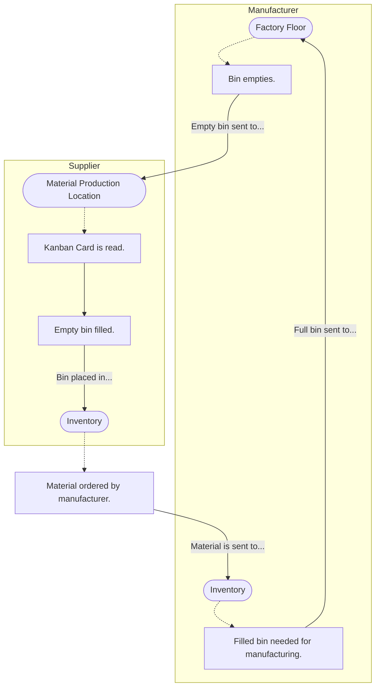

# Kanban Systems as a Display of Demand: A Combinatoric Perspective
## Introducing the Kanban System
In manufacturing, a Kanban system is a method of supplying materials by using an information card called a Kanban card as a signal to resupply a particular material. The word "kanban" means "signpost" in Japanese. 

When manufacturing processes convert raw materials into finished goods, there are bins that hold the various materials. As processes run, those bins are eventually emptied. In a Kanban system, each bin holds an information card about the particular material. When an empty bin is sent to a supplier, the supplier knows to send a full bin of the material to the manufacturer based on the card's description. Once the full bin is sent, the supplier also knows to produce more of that same material to remain in stock. This way, when the manufacturer empties the next bin of the same material and orders more from the supplier, the supplier can send the manufacturer the full bin in exchange for the empty bin. This process then repeats itself as the running time continues. 

Below is a diagram to depict a bin's movement between the manufacturer and supplier in the Kanban system.
<!-- As of August 2nd, 2026, nodes in differing subgraphs can link ONLY if the subgraphs have NO specified direction. -->

When a manufacturer employs this system in production, they
- prevent excessive surplus of materials for production, and
- allow each process to have necessary materials for manufacturing.

## Question of Interest
Since the Kanban card serves as a signal to the supplier that a particular material has been consumed and needs to be produced more of, we find that <!-- May become a quote later. I want to emphasize this point.-->consumption drives production through the Kanban card. The Kanban card also signals demand for a particular material because the material is actively being requested for the manufacturing process.

+ _<ins>Note</ins>: From here through the rest of the article, the mention of "**process**" refers to a **manufacturing process**: a line-up of tasks that directly convert raw materials into finished goods._

Now, because a manufacturing facility may have multiple processes running at one time, it is possible that there are various scenarios of Kanban cards to be revealed for their respective materials. To better prepare for those scenarios, a facility may desire to know the possible structures of demand to encounter given the materials involved in each process. Knowing this requires us to ask this question:

>"How can the Kanban system be used to display possible structures of demand?"

## Assumptions For Representation
To delve into this question, let's establish some assumptions for our representation of a Kanban system.

1. Say that a factory holds a fixed number of various types of materials or parts, like bolts, nuts, gallons of paint, planks of lumber, and many others. Let's call this fixed number N.
2. Each of these N types of materials are available to readily contribute to any of the factory's manufacturing processes (from raw materials to finished goods).
3. Let's also assume that each process runs for the same predetermined process running time period, which is in some amount of hours, minutes, and seconds.
4. As each process empties bins for each material, assume that it has a full bin ready to be used (or drawn from) and the empty bin is immediately sent to the supplier.

_<ins>Note</ins>: For assumption #1, it's important to mention that each type of material has differing attributes, no matter how similar they are. For example, a 4" by 4" by 10' plank of pressure treated wood is a different material than a 4" by 4" by 15' plank of pressure treated wood._

### Consequences of Assumptions
Since this factory employs a Kanban system, then it's true that each of the N materials reveals a certain number of Kanban cards over the predetermined process running time period. 

+ _<ins>Note</ins>: From now on, the words "running time", "time interval", or "time period" will refer to the "predetermined process running time period". Also, the words "card" or "cards" will refer to a "Kanban card" or "Kanban cards"._

Let's allow **$`c_i`$** to be the nonnegative number of cards that show the $`i^{\text{th}}`$ type of material during the time period, where $`i`$ is a whole number greater than 0 and less than or equal to N. (*Ex. If a 1/4' standard washer is material 1, and 5 cards show during the time period, then $`c_1`$ = 5 represents the Kanban cards for this particular washer during the time period.*)

Once we have a card count for all N types of materials, then we can add all of the card counts to obtain a number K, which is the total number of cards shown during the running time. As an equation, this statement shows $`c_1`$ + $`c_2`$ + ... + $`c_N`$ = K.

Now, the total K cards gives us a consumption notice of materials among the N types. Knowing this is crucial for counting possible demand results in the factory, especially since materials consumed in its processes indicate materials to be produced more of by the supplier. To find those demand results, we can ask "how many possible processes will reveal a specific amount of cards (like 6 cards, or 21 cards, etc.)"?

## Process Counting Reasoning
If there is a specified number of total cards, like K = 4, then we want to know how many possible outcomes of processes will yield that specified number. We will define the outcome of a process to be the count of cards revealed for each type of material when the running time passes.

### Counting Outcomes of One Process
In the eyes of the supplier, the cards in the bins of each respective type of material (Ex. if 3 cards are revealed from material 4) are <ins>identical</ins> and <ins>indistinguishable</ins>.
* The cards are <ins>identical</ins> because the information on the cards for the material are about the same type of material. Each card is the same!
* The cards are <ins>indistinguishable</ins> because they can be switched around to appear in any order during the time period and the message to the supplier is to produce more of that type of material. No matter the order in which they appear to the supplier, the message to the supplier is the same!
<!-- **This perspective will be important later in this section! (may include this)**-->

Viewing from supplier's perspective of the cards, once the total K cards are split into the N groups of sizes $`c_1`$, ... , $`c_N`$ for the types of materials, we are able to count that splitting arrangement as an outcome of one process. If we begin with a line-up of all K cards, we can see that there are $`K - 1`$ spaces in-between the K cards, as shown below.

<!-- Mermaid diagram here -->
Placing a partition in one of the spaces allows us to divide the K cards into smaller groups. If there are N types of material, we can let one group represent one type of material. To split the cards into N groups, we will need $`N - 1`$ separators between the $`c_1`$, ... , $`c_N`$ groups. This is shown below.

<!--- Try Latex Here for this diagram -->
+ _Note: Applying $`N - 1`$ separators to the total cards assumes that the sizes of each group are greater than 0, which is makes the values $`c_1`$, ... , $`c_N`$ not nonnegative, but only positive. For now, this assumption is necessary since it is easier to count groups that have cards in them compared to empty groups. This restriction will be relaxed later._

Once the separators are placed, then we have a possible outcome of one process, which is one possible consumption distribution of cards.

### Counting All Possible Process Outcomes
Depending on where the separators are placed between, we obtain differing group sizes for the N types of materials. If we count the number of ways that each one separator can be placed in spaces between the cards, then we also count the number of possible differing group sizes for each type of material where each group is greater than 0 (for now). In turn, we also count the number of possible process outcomes for a total of K cards.

Let's begin placing the separators. The $`1^{\text{st}}`$ separator has $`K - 1`$ possible locations for placement. The $`2^{\text{nd}}`$ separator has $`K - 2`$ possible locations for placement. This pattern continues through the $`(N - 1)^{\text{th}}`$ separator, which has $`K - (N - 1)`$ possible locations for placement. Since for every one placement of the $`1^{\text{st}}`$ separator, there are multiple placements for each of the other separators, the number of possible placement outcomes, and in turn process outcomes, is given by

<!-- OA here --->

Now, since each separator has no distinction from the others despite their location of placement, <!-- Pick up Here after break-->

## Interpretation
### Example
Say we have 4 Kanban cards show up among processes that have 3 materials available for use throughout the factory. These materials are wood, screws, and paint. How many possible ways can we expect the kanban cards to reveal themselves as they are used?

One possible process can show 2 kanban cards for wood, 1 card for screws, and 1 card for paint. For this process, we can ask these questions for each group of kanban cards:

- "How many ways can 2 information cards for wood show up in a group of 2 to result in different production outcomes?"
- "How many ways can 1 information card for screws show up in a group of 1 to result in different production outcomes?"
- "How many ways can 1 information card for paint show up in a group of 1 to result in different production outcomes?

_Note: Remember! The information cards are identical and indistinguishable._

<!-- Mathematical jump again -->
The answer to each of these questions is 1 way. 

Using combinations, this one process is expressed as the number  
<!-- Mathematical Expression on page 16a -->

$$\displaystyle{\binom{2}{2} \cdot \binom{1}{1} \cdot \binom{1}{1} _\text{.}}$$ 

There are many other processes that have 4 cards show up among the types of material. Other examples include, but are not limited to,...
- 3 cards for wood, 1 card for screws, and 0 cards for paint
- 1 card for wood, 2 cards for screws, and 1 card for paint
- 0 cards for wood, 0 cards for screws, and 4 cards for paint

The total number of processes where 4 Kanban cards are found in the 3 types of material adds all of the processes like the ones previously listed. The expression to represent this sum is 
<!-- Mathematical Expression on page 16b --> 

$$
\displaystyle{
  \sum_{
    \substack{
      (c_1 + c_2 + c_3): \\
      c_1 + c_2 + c_3 = 4
    }
  }
  \binom{c_1}{c_1} \cdot \binom{c_2}{c_2} \cdot \binom{c_3}{c_3}
  _\text{,}
}
$$

where $`c_1`$, $`c_2`$, and $`c_3`$ are the number of cards for the first type of material (wood), second type of material (screws), and third type of material (paint) respectively. The sum of $`c_1`$, $`c_2`$, and $`c_3`$ is 4.

### What does this mean?
The resulting number from the sum of all possible process outcomes with the chosen Kanban card total K is the total number of ways that the types of material can be consumed given the predetermined process running time. Because the cards are signals of production, and consequently the requested demand for the materials, this result gives the total number of <ins>**possible demand structures**</ins> for the factory in their manufacturing process over the running time. 

### How can this be helpful?
If a factory using a Kanban system knows what possible demand structures exist and how many, then decision-makers may be able to determine how likely it is for certain types of material to reach a certain consumption level during the running time period. When determining likelihoods of such consumption events, this calculation will determine the basis from which the events can come from. Although I don't see how at the moment, the calculation may assist with predicting the requested demand of the types of goods before production processes begin.

## Extending Questions
The question we began exploration with is "How can a Kanban system be used to display possible structures of demand?". From previous obeservations, the Kanban system can be used to show possible displays of demand by counting the total number of ways a specific amount of Kanban cards can show up among all availible types of material to be used in a factory. 

- In this post, the Kanban system referred to is the two-bin system. However, during my reading, I found that there are many other types of Kanban systems like the Constant Work In Progress (CONWIP) system, the extended kanban system, and the generalized kanban system. How would the make-up of those systems change the make-up of our counting expression?

- Also in my reading, I learned about something called the Economic Order Quantity, which is the amount of materials/parts a company may order to minimize the cost of storing them for production. When a company is finding this measurement for a particular process, how does it impact the timing of kanban cards showing in the production process?

We may explore these questions on a later date, as they may add on to the discussion about Kanban systems. To the reader, I appreciate your time given to read this exploration, and I will see you on the next post!
